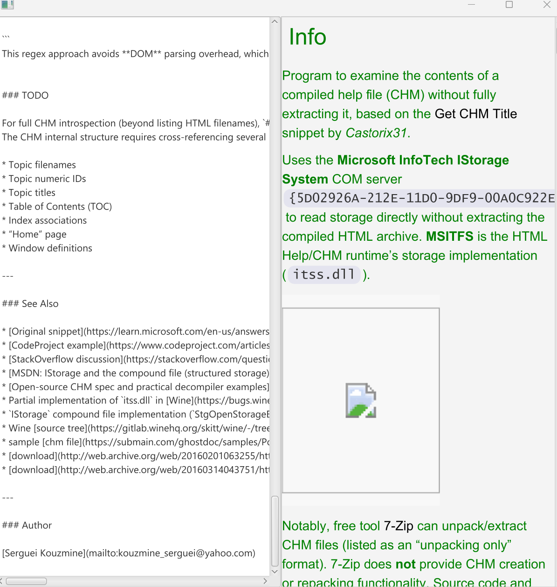

### Info

This directory contains a minimal desktop application showcasing a standalone replica of the  
[`MarkdownView`](https://github.com/JPro-one/markdown-javafx-renderer) __Markdown for JavaFX__ advanced HTML WebView renderer hosted inside a basic [JavaFX](https://en.wikipedia.org/wiki/JavaFX) UI to run on Linux or Windows laptop.


The project uses:

* [`flexmark-java`](https://github.com/vsch/flexmark-java) — a Java implementation of the [CommonMark 0.28](https://spec.commonmark.org/0.28/) specification  
* [`cssfx`](https://github.com/mcfoggy/cssfx) — real-time CSS reloading  
* A classic Maven `pom.xml` (replacing the original gradle )  
* Java **1.8** and an Java __11+__ SDK with __JavaFx__ present e.g on **Azul Java 11** launcher for Windows and Linux

This setup provides a clean, dependency-controlled JavaFX Markdown renderer suitable for pre-commit checks against broken markdown syntax.

---

### Usage

#### Launcher scripts

Windows (Java 8):
```cmd
test.cmd
```

Windows (Java 11):
```cmd
test-jdk11.cmd
```

#### Manual run

```cmd
mvn clean package
java -cp target/example.javafx_markdown.jar;target/lib/* example.Example
```

---

### Author

[Serguei Kouzmine](mailto:kouzmine_serguei@yahoo.com)
