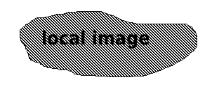

## Style
```
*cursive*
**Bold**
***Bold and Cursive***
```
*cursive*
**Bold**
***Bold and Cursive***

## Links:
```
[link](https://google.com)
```
[link](https://google.com)

### Table
```
property | description | defaultvalue
 --- | --- | ---
asdf | asdfsdf | asdf
```
property | description | defaultvalue
 --- | --- | ---
asdf | asdfsdf | asdf

## Pictures
* local image
```

```


* image loaded from the `.jar`

```

```


* image from earlier deployed `README.md`

```

```


## Headline:
```
# Asdf
## Asdf
```
# Asdf
## Asdf

## Bulletpoints:
```
* Point1
* Point2
* Point3
```
* Point1
* Point2
* Point3
