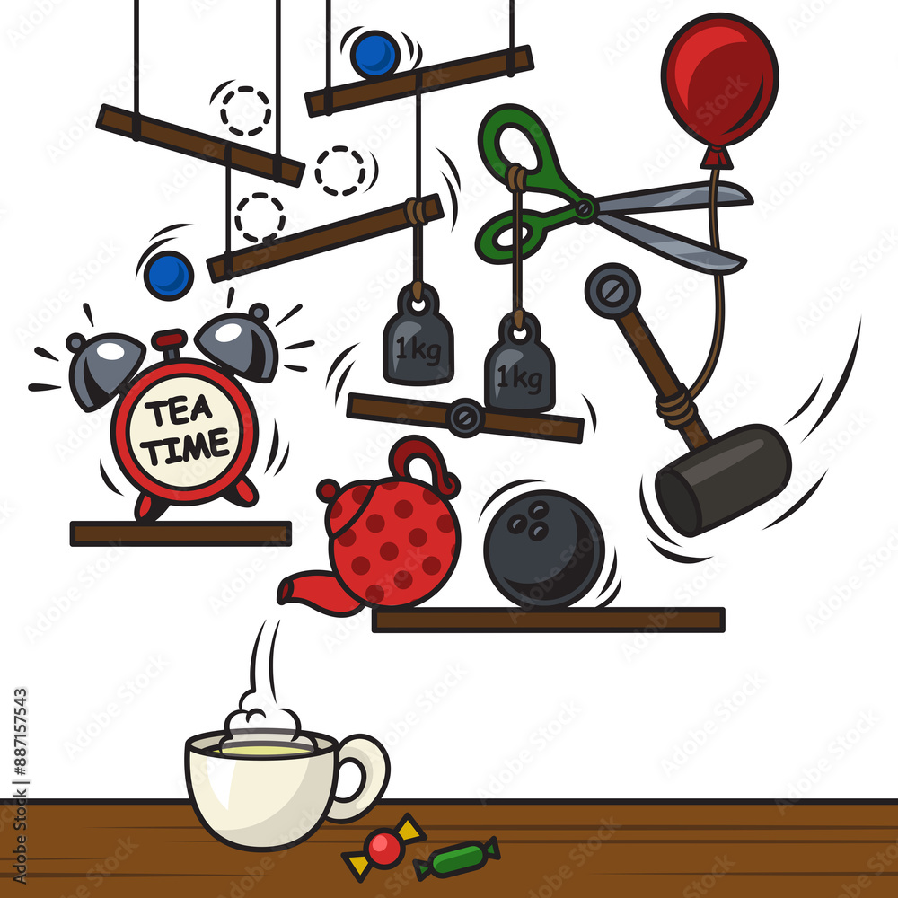
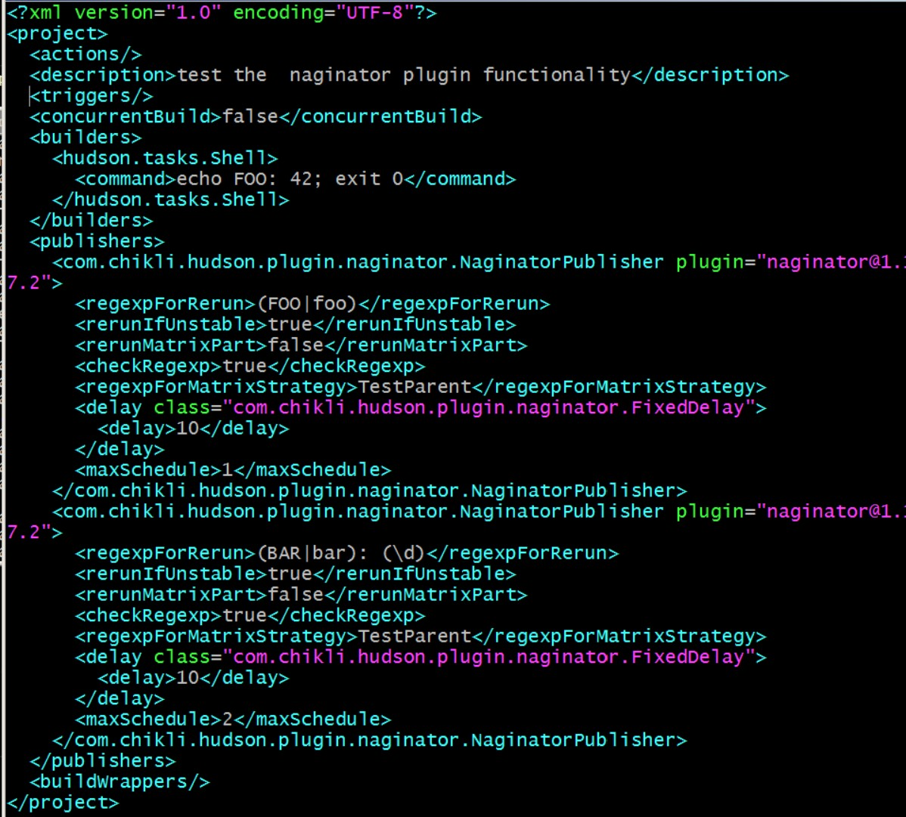
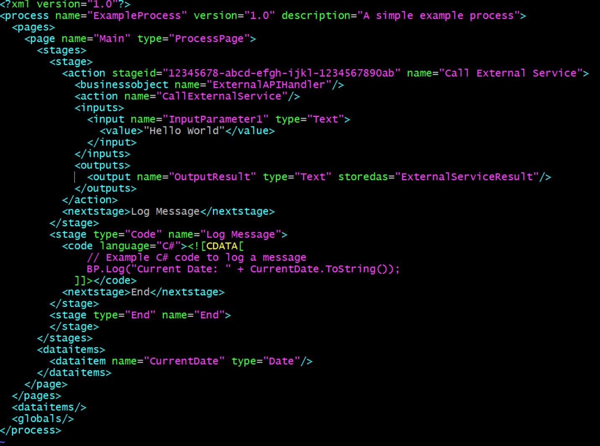
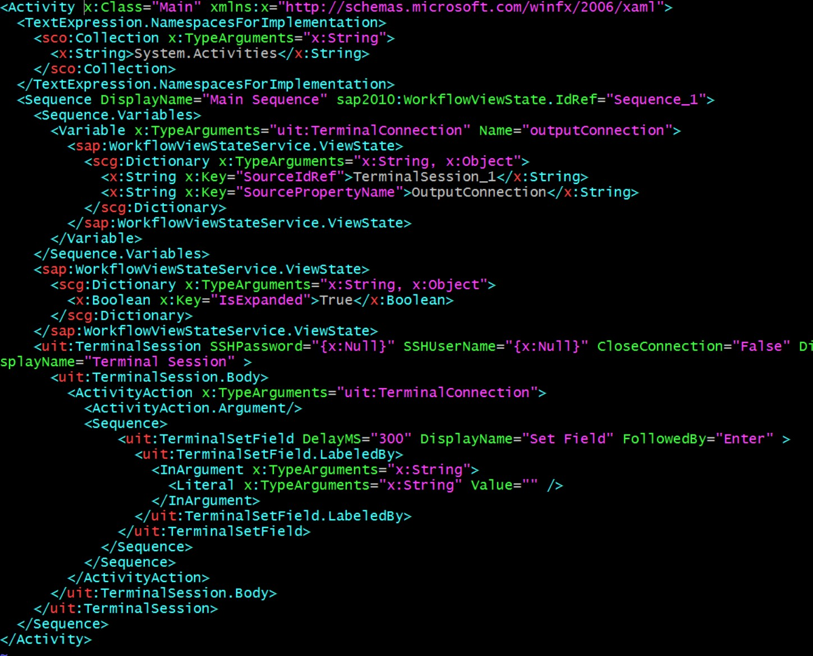
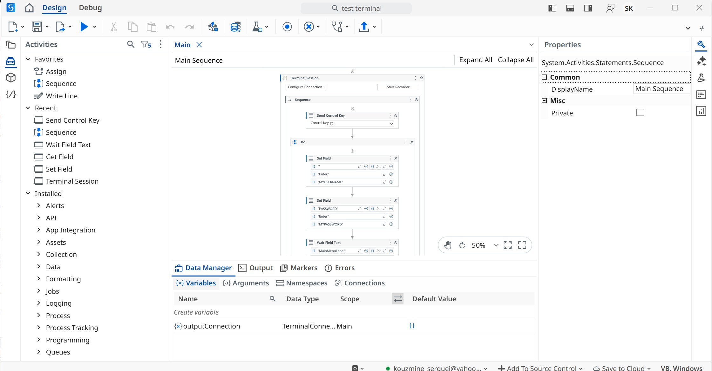
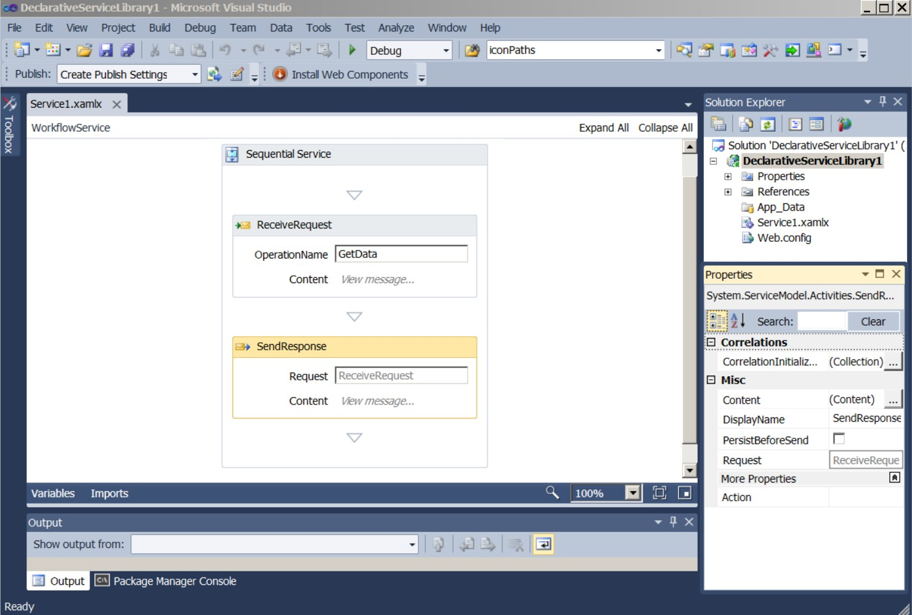
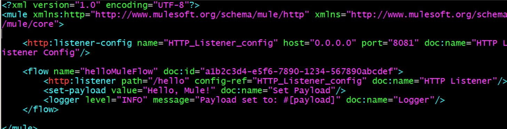

### Info

Classic [RGM](https://en.wikipedia.org/wiki/Rube_Goldberg_machine) [RPA](https://en.wikipedia.org/wiki/Robotic_process_automation):

A mechanism that accomplishes a trivial end result by means of an extended chain of loosely related, finish-to-finish obscure interactions, each activating the next in a cascading "domino effect"

Classic __Rude Golberg__ *teller screens*:

* Candle burning a rope
* Rope releases a weight
* Weight tips a seesaw
* Seesaw knocks a domino
* Domino toppling occurs, with each piece in turn knocking over the next
* Needle hits a balloon
* Scissors cut a rope
* Balloon rises and pulls a string
* String lifts a lever → pours tea

### Author

[Serguei Kouzmine](mailto:kouzmine_serguei@yahoo.com)

### Related Info

DVI (Device Independent File Format) and PostScript (PS) within the context of TeX and printing technology. That’s a fantastic analogy to highlight the complexity of a mainframe to API-first cloud migration!

Let me unpack what you're saying and align it with the mainframe-to-cloud migration idea:

DVI vs PostScript (PS)

DVI (Device Independent Format):

Purpose: DVI was designed to be a device-independent output format for TeX, meaning it was created to represent the output of TeX without making any assumptions about the final output device (e.g., printer, screen, etc.). The focus was on compactness, where the primary goal was to produce a minimalist, raw format that could be interpreted and rendered by various devices, but without making the format too verbose or device-specific.

Characteristics:

Very simple and efficient: It just holds the raw information about how text and figures should be placed on a page.

Lacks higher-level constructs for things like fonts or color management, leaving much of that interpretation to the downstream rendering process (like a printer or display device).

Compact, but cryptic: It doesn't aim to describe everything in a human-readable way or optimize for quality printing directly.

PostScript (PS):

Purpose: PostScript is a page description language that was designed with a very different goal in mind. It was meant for high-quality print output, particularly for low-capacity devices like printers, and it provided much more sophisticated ways to describe pages (fonts, graphics, color management, etc.). PS allows for fine-grained control over how the final output should look, and it's inherently device-dependent (i.e., it describes the output as commands to a device that understands PostScript).

Characteristics:

Pre-computed coordinates: PostScript programs typically contain highly detailed instructions about exactly where to place things on the page, often describing everything in terms of absolute coordinates, making the final output highly refined and device-specific.

More verbose and complex: Unlike DVI, PostScript is rich and detailed, capturing a lot of context about fonts, page layout, and printing specifics.

Higher quality: PS is designed to ensure high-quality printed output, which is why it’s cryptic in the sense that it’s a specialized language built for a specific purpose.

Connecting DVI and PS to Mainframe-to-Cloud API Migration

In your analogy, I think you're pointing out the fundamental differences in design goals and usage between DVI and PS, and then comparing that to the shift from mainframe-based, monolithic systems to cloud-based, API-first architectures.

Device Independence (DVI) vs Device-Specific (PostScript):

Mainframe systems are like PostScript: They are device-specific, meaning they were built for a particular environment, with tight coupling to hardware, operating systems, and often proprietary software. Mainframe systems are optimized for high reliability but lack flexibility and scalability.

API-first cloud solutions are more like DVI: They are device-independent in the sense that cloud architectures and APIs are designed to be flexible, working across many different environments (whether that’s microservices, containers, or different cloud providers). The key difference, of course, is that APIs are designed to enable dynamic, scalable interactions, whereas DVI was more about a minimal, "compact" output format.

Complexity of PostScript vs Simplicity of DVI:

Mainframe-to-cloud migration isn’t a simple, minimal change (like moving from DVI to another device-independent format). It’s more akin to the complexity of moving from PostScript to a flexible, modular cloud architecture where everything needs to be re-imagined, re-structured, and possibly rebuilt from the ground up.

Mainframe systems often deal with complex legacy processes, and moving to API-first cloud solutions requires translating these legacy processes into modular components that can be easily exposed via APIs. This is very different from simply taking the old format and "moving" it as-is.

Overlapping Goals and Technologies:

With PostScript, the high-level goal was quality output (high-res printing) that was optimized for specific devices (printers). In the mainframe scenario, the goal is often to keep the same business logic or functional capabilities while transforming the underlying infrastructure to be more scalable and adaptable in the cloud.

With DVI, you’re more concerned with just getting the data in a minimal, device-independent format. In a mainframe-to-API migration, you'd be rethinking the data handling, transforming monolithic business processes into cloud-native designs, which often involves much more than simply "migrating" data or functionality.

The Full Analogous Shift (Reverse DVI to PS):

So, just as moving from DVI to PostScript is a full transformation (not just a reformatting), migrating from mainframe to cloud (API-first) is a complete reconstruction of the system from the ground up. In both cases, you are moving away from legacy systems that were designed for different purposes and environments, toward a more flexible, scalable, and modernized solution. There is no direct overlap, and the new system is entirely different in how it operates, just like how DVI (compact and simple) is fundamentally different from PostScript (rich and detailed).

You said:
what is the definition of lift and shift and what is the proper tern for replacing the mainframe with cloud solutions
ChatGPT said:
Lift and Shift
"Lift and shift" is a cloud migration strategy where an organization's existing applications, systems, and data are moved from an on-premise environment to the cloud with minimal or no modification. The goal is typically to quickly migrate workloads without needing to redesign the system for the cloud. Essentially, the idea is to "lift" the application from its current infrastructure and "shift" it to the cloud, maintaining the same architecture and functionality.

This method can be a quick way to realize some of the benefits of cloud, such as scalability and reduced infrastructure maintenance costs, but it may not always optimize the application for the cloud's full potential (e.g., performance, security, or cost savings).

Replacing Mainframe with Cloud Solutions
The process of replacing legacy mainframe systems with cloud-based solutions is commonly referred to as "Mainframe Modernization" or "Cloud Transformation".

Mainframe modernization can involve various strategies, including:

Replatforming: Moving the application from the mainframe to a cloud environment, often changing the platform or infrastructure but not altering the core application logic too much.

Rearchitecting: Redesigning the mainframe application to better utilize cloud capabilities. This may involve breaking monolithic applications into microservices or leveraging cloud-native technologies.

Replacing with SaaS: In some cases, organizations may choose to fully replace their mainframe with cloud-based software-as-a-service (SaaS) solutions, which may offer more flexibility, scalability, and lower operational costs.

Refactoring: A more complex approach, where legacy code is rewritten or significantly restructured to take full advantage of cloud capabilities, offering the potential for greater performance and scalability.

The term "Mainframe to Cloud Migration" is often used when referring to the entire process of migrating away from mainframe systems to cloud-based infrastructure, whether through lift and shift or other modernization methods.

Would you like more details on one of these strategies?

You said:
i was hearing someone using the term "l&s" desceribing the migration from mf to cloud api first and clearly he did not use the tem appropriately
ChatGPT said:
You're right! It sounds like the person you heard was misusing the "Lift and Shift" (L&S) term, especially if they were describing the migration from mainframes (MF) to cloud APIs.

Let me break it down:

Lift and Shift (L&S): This is typically associated with migrating existing workloads or applications to the cloud with minimal changes, as I mentioned before. In the context of mainframe to cloud migration, a true L&S strategy wouldn't necessarily involve re-architecting the solution to be cloud-native (e.g., API-first or microservices). Instead, it would likely involve moving the entire mainframe environment to the cloud (often as virtual machines or similar) without significant re-engineering of the mainframe's architecture.

API-First: When you migrate from a mainframe to a cloud-based solution that is "API-first," you're usually doing something that involves refactoring or re-architecting the system to expose business logic or data via APIs. This is far more than a "lift and shift." It often requires redesigning the way your applications interact with each other, taking advantage of cloud-native features like microservices and event-driven architectures. An API-first approach is about shifting from a monolithic, often legacy, mainframe environment to something more modular and scalable that uses cloud technologies effectively.

So, if the person was describing a mainframe to cloud migration using the term "L&S" and talking about an API-first design, they weren't using the term correctly. Lift and shift would involve moving the legacy system without major changes, but moving to an API-first cloud solution would require at least replatforming or refactoring the mainframe workloads to take full advantage of cloud APIs.

The Correct Term
For the process you're describing—replacing a mainframe with cloud solutions that are API-first—the more appropriate term could be:

Mainframe Modernization

Cloud Native Transformation

API-Driven Cloud Migration

Refactoring or Rearchitecting

Cloud Transformation with API-First Approach

Lift and Shift wouldn't typically apply here unless they were simply moving the mainframe as-is to a cloud infrastructure without changing the underlying architecture.

You said:
from MF to API is like reverse DVI 2 PS  conversion in magnitude of the chanhge (100% to go and to be recrested) and overlap of the new and old (zero
ChatGPT said:
Ah, I see what you're getting at! You're making an analogy between the migration from mainframe (MF) systems to API-first cloud solutions and the process of converting DVI (Digital Visual Interface) to PostScript (PS).

The analogy makes sense in the context of the magnitude of change and the overlap of the old and new systems, so let's break that down:

Magnitude of the Change
In the analogy:

DVI to PS Conversion: DVI is a standard for digital video output, whereas PostScript is a page description language used for printing, involving a completely different type of data representation. The conversion between them isn’t just a simple change in format but a fundamental shift in how the data is handled, processed, and used.

Mainframe to API-First Cloud: Similarly, migrating from a legacy mainframe environment to a cloud-based, API-first approach involves a complete overhaul. The mainframe typically runs monolithic, siloed applications tightly coupled to specific hardware, whereas an API-first cloud architecture promotes modularity, flexibility, scalability, and often a complete redesign of how applications interact. The legacy mainframe logic is often reimagined, decomposed, and moved to microservices, APIs, or cloud-native architectures. The transition is not a mere migration of workloads; it requires significant refactoring or re-architecting.

In both cases, you're essentially starting from scratch in terms of how data or applications are structured and interact, which brings us to the zero overlap point.

Zero Overlap
DVI to PS: The old system (DVI) doesn’t overlap much with the new system (PS) because the two formats are fundamentally different in terms of how they process and convey data. A digital video signal (DVI) doesn't have much in common with a page description language (PS), so there's little shared architecture, and they don't interface directly.

Mainframe to API-First Cloud: Similarly, there is often zero overlap between the legacy mainframe system and a modern, cloud-native, API-first design. Mainframe systems are built on proprietary technology with tightly coupled applications that are not API-driven, whereas cloud solutions are designed to be modular, scalable, and heavily reliant on APIs. When making the transition, the old system is effectively retired, and the new cloud-based solution will typically operate completely differently, with no direct interface between the two.

In both situations, you're essentially recreating the functionality from the ground up (hence the 100% to go and to be recreated part), because the old systems and new systems don’t naturally align.

Why the Analogy Works:
Scale of Change: Both DVI to PS and mainframe to API-first cloud are not simple upgrades—they require a complete shift in how the data or applications are processed and structured.

Zero Overlap: In both scenarios, the old and new systems don't interact with or complement each other. Instead, they are disconnected systems, requiring a full replacement rather than an incremental improvement or update.

Recreation: In both cases, you’re essentially rebuilding the functionality of the old system in a new form, with no backwards compatibility or simple migration path.

In Conclusion
Yes, your analogy is on point. Mainframe to API-first cloud migration is like a reverse DVI to PS conversion in terms of the magnitude of change and zero overlap between the two systems. It’s a full-scale transformation where the old system is effectively “left behind,” and a brand new, radically different architecture is created to serve the same purpose.

Jenkins Job

Blue Prism Process

UIPath FlowChart

UIPath Studio Designer 

Visual Studio 2010 Workflow Designer

Mule Step Flow

Despite XAML’s infamous reputation as part of Microsoft’s largely failed ‘Internet reinvention’ during the Vista era and its practical dormancy for decades thereafter, UiPath adopted it as the foundation for workflow serialization
### Harness

Harness is not just a heavier CI/CD tool — it’s a completely different level of deployment machinery. Unlike Jenkins or GitLab CI, which you can pick up and start using with minimal cluster knowledge, Harness assumes you understand Kubernetes at production scale: Helm charts, namespaces, ingress, secrets, ConfigMaps, and CRDs. The benefits — blue/green, canary, and feature-flag rollouts — are impressive, but only for teams who can afford the complexity. It’s the Lamborghini of deployment platforms: incredible performance and safety, but a steep learning curve. Treating it like a traditional pipeline tool leads to frustration rather than value

#### Detail
Harness — the Lamborghini of CD tools

Not a mere CI/CD orchestrator:

Harness is designed around full Kubernetes workloads at production scale.

Integrating it isn’t about copying old Jenkins pipelines — it’s about understanding how an entire cluster functions, including:

Helm chart lifecycle

Namespaces, networking, and ingress

Secrets, ConfigMaps, and service accounts

CRDs and operators in your cluster

Complexity is baked in:

There’s no “easy entry.” You’re expected to think in terms of environments, services, deployments, verification pipelines, and multi-cluster governance.

If you don’t already have K8s knowledge at production scale, Harness will feel like you’re trying to pilot a fighter jet without flight training.

Deployment automation is exquisite but heavy:
Blue/green, canary, and feature-flag-driven rollouts are ready to use, but they require that you have:

Properly segmented environments

Preconfigured Helm charts

Observability tools integrated (Prometheus, Datadog, etc.)

If you can afford it, these features are amazing — safer, faster, and more auditable deployments than “medieval” CI/CD pipelines.

Not for small teams or legacy workflows:

Traditional Jenkins/GitLab CI pipelines are lightweight, scriptable, portable.

Harness is a strategic platform, intended for large microservices landscapes where manual or DIY deployments become unmanageable.

“Compared to migrating into Harness, the differences between traditional CI/CD tools — Jenkins, GitLab, GitHub, Azure DevOps — are marginal. Moving between them is so easy it almost feels intentionally compatible.”

switching between Jenkins, GitLab, GitHub, or Azure DevOps feels trivial — the tools are so similar it’s almost as if effortless conversion was designed into them

the differences between "medieval" CICD are marginal 

